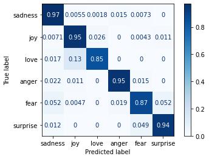

# Emotion Classification

This is a emotional sentiment analysis review / comment / text classification with the BERT model from [huggingface.co](https://huggingface.co).

## Machine Learning

### Confusion Matrix for machine learning

### Specification

- tokenizer = AutoTokenizer.from_pretrained("bert-base-uncased") or nltk
- Bert-Large-Uncased -> changed to bert-base-uncased
- pytorch

## App

- django backend
- nextjs frontend
